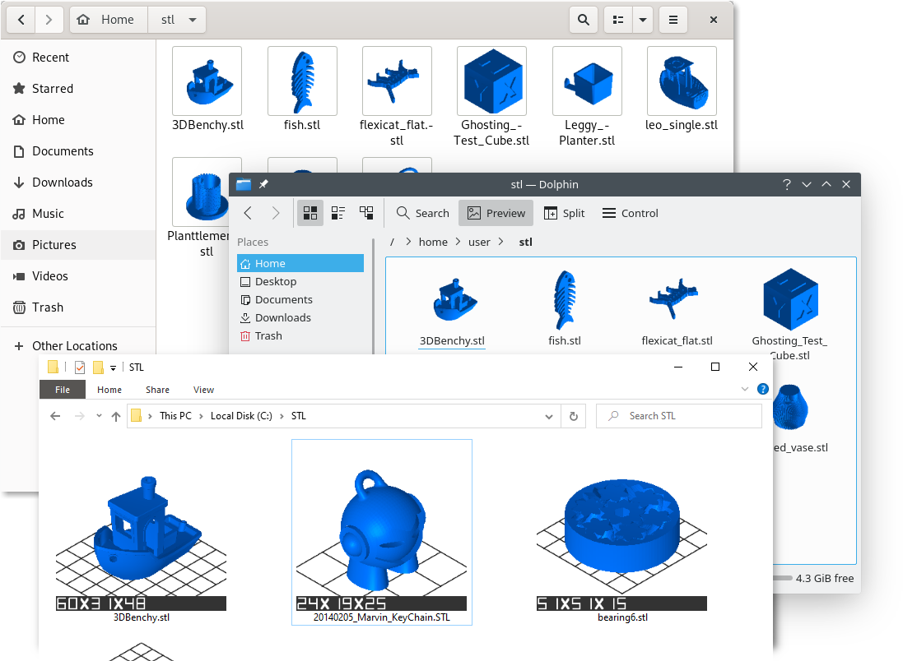

[](https://github.com/krepa098/stl2thumbnail_rs/actions/workflows/tests.yml)
[](https://github.com/krepa098/stl2thumbnail_rs/actions/workflows/win32.yml)
[](https://github.com/krepa098/stl2thumbnail_rs/actions/workflows/makepkg.yml)

# stl2thumbnail_rs 

A thumbnail generator for Windows and Linux supporting ```stl```, ```3mf```, ```gcode```,  and ```bgcode``` files.



## Supported Desktops and File Formats

| Desktop  | stl                |       gcode [3]    |      bgcode [1,3]  |            3mf [3] |
|----------|--------------------|--------------------|--------------------|--------------------|
| Gnome    | :white_check_mark: | :white_check_mark: | :white_check_mark: | :white_check_mark: |
| KDE      | :white_check_mark: | :white_check_mark: | :white_check_mark: | :white_check_mark: |
| Windows  | :white_check_mark: | :white_check_mark: | :white_check_mark: | :x: [2]            |

[1] [Prusa's flavor](https://github.com/prusa3d/libbgcode)

[2] Native support

[3] Requires embedded previews

## Install

Use the precompiled packages from the ```Releases``` section, or compile it yourself:

```
git clone https://github.com/krepa098/stl2thumbnail_rs
cd stl2thumbnail_rs
mkdir build && cd build
cmake -DCMAKE_BUILD_TYPE=Release -DCMAKE_INSTALL_PREFIX=/usr -DKDE=ON -DGNOME=ON ..
make
sudo make install
```

## License
This work is licensed under CC BY 4.0 